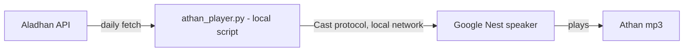

# Prayer Times on Google Nest

Plays the Athan (call to prayer) on a Google Nest speaker at each prayer
time, fully automatically.

## How it works



A small **Python script** runs continuously on a machine on your home
network (e.g. a Raspberry Pi, NAS, or always-on PC). Each day it fetches
that day's prayer times (Fajr, Dhuhr, Asr, Maghrib, Isha) from the
[Aladhan API](https://aladhan.com/prayer-times-api), and at the exact
moment each one arrives, casts the Athan audio file directly to your
Google Nest speaker.

### Why a local script, and why not Home Assistant or Google Calendar/Routines?

Google's own platform has no way to do this end-to-end: Google Home
Routines can't be triggered by a calendar event, and even if they could,
Routine actions can't play an arbitrary external MP3 URL (only tracks from
a linked Spotify/YouTube Music account, or built-in chime sounds). Casting
a specific audio file to a Nest speaker on a precise, daily-shifting
schedule requires something that speaks the Cast protocol directly -
that's what `athan_player.py` does, using the `pychromecast` library,
without needing Home Assistant or any other hub.

Because Cast device discovery is local-network only (mDNS), this script
has to run on a machine on the same network as the speaker - it can't run
in the cloud.

## Repo contents

```
local-athan-player/
  athan_player.py             - the daemon that casts the Athan at prayer time
  config.example.py           - copy to config.py and fill in your details
  requirements.txt
  athan-player.service        - systemd unit to run it persistently (Linux)
  install-windows-task.ps1    - registers a Scheduled Task to run it persistently (Windows)
```

## Prerequisites

- A Google Nest speaker/display already set up in the Google Home app.
- A machine that's always on and on the same Wi-Fi/LAN as your Nest
  speaker - a Raspberry Pi is the typical choice, but any always-on Linux
  box (or a PC/NAS) works. Needs Python 3.9+.
- About 10 minutes.

---

## Step 1 - Pick your calculation method

Prayer times depend on a calculation method that varies by region/authority
(e.g. Muslim World League, Egyptian General Authority, Umm al-Qura, ISNA...).
See the full list at [aladhan.com/calculation-methods](https://aladhan.com/calculation-methods)
and find the method ID matching your local mosque/authority. This repo
defaults to `3` (Muslim World League) - you'll set this in Step 2.

---

## Step 2 - Set up the Athan player

1. On your always-on machine, get this repo onto it (e.g. `git clone` or
   copy the `local-athan-player/` folder over), then install dependencies:

   ```bash
   cd local-athan-player
   pip install -r requirements.txt
   ```

2. Copy the config template and edit it:

   ```bash
   cp config.example.py config.py
   ```

   - `CITY`, `COUNTRY`, `METHOD`, `TIMEZONE` - your location and the method
     ID from Step 1.
   - `CAST_DEVICE_NAME` - the exact name of your speaker/display as shown
     in the Google Home app (Settings > Device name).
   - `VOLUME` - 0.0 to 1.0.
   - `BACKGROUND_IMAGE_URL` (optional) - if your device has a screen (e.g.
     Nest Hub), this image is shown as the small thumbnail/album-art in the
     corner of the default "Now Playing" screen while the Athan plays
     (the Default Media Receiver doesn't support a full-screen custom
     image for audio playback). Must be a public, directly-loadable image
     URL. Leave as `""` to use the device's default.
   - Make sure this machine's **system timezone** also matches `TIMEZONE`
     (e.g. `sudo timedatectl set-timezone Europe/London`), since the script
     uses the system clock to decide when to fire.

3. Test connectivity - this casts the Athan immediately, without waiting
   for an actual prayer time:

   ```bash
   python3 athan_player.py --test
   ```

   Your Nest speaker should immediately play the Athan. If it doesn't, see
   [Troubleshooting](#troubleshooting).

4. Once that works, install it so it starts automatically at boot and keeps
   running (restarting itself if it ever crashes). Pick your OS below.

### Linux (systemd)

```bash
# edit WorkingDirectory / ExecStart / User in athan-player.service first
sudo cp athan-player.service /etc/systemd/system/
sudo systemctl daemon-reload
sudo systemctl enable --now athan-player
```

Check it's running and watch the logs:

```bash
systemctl status athan-player
journalctl -u athan-player -f
```

### Windows (Scheduled Task)

[`install-windows-task.ps1`](local-athan-player/install-windows-task.ps1)
registers a Scheduled Task that starts the script at boot under the
SYSTEM account (so no one needs to be logged in) and restarts it
automatically if it crashes - the Windows equivalent of the systemd unit
above.

1. Open PowerShell **as Administrator**.
2. Run:

   ```powershell
   cd path\to\local-athan-player
   powershell -ExecutionPolicy Bypass -File .\install-windows-task.ps1
   ```

3. This creates a task named `AthanPlayer` (visible in Task Scheduler) and
   starts it immediately. Logs are appended to
   `local-athan-player\athan_player.log`.

   Watch the logs live:

   ```powershell
   Get-Content .\athan_player.log -Wait -Tail 20
   ```

To remove it later: `Unregister-ScheduledTask -TaskName "AthanPlayer"`.

> If `python` isn't found, install it from
> [python.org](https://www.python.org/downloads/) and make sure "Add
> python.exe to PATH" is checked during install - the Microsoft Store
> version sometimes only registers an app-execution alias that scheduled
> tasks running as SYSTEM can't see.

From here, the script independently re-fetches prayer times every day at
midnight rollover and casts the Athan at each one, with no further action
needed - on either OS.

---

## Troubleshooting

- **`Cast device "..." not found on the local network`** - confirm
  `CAST_DEVICE_NAME` matches the Google Home app exactly; confirm this
  machine is on the same Wi-Fi/VLAN as the speaker (mDNS discovery doesn't
  cross subnets/VLANs); check no firewall is blocking mDNS (UDP 5353) - on
  Windows, check Windows Defender Firewall isn't blocking the network
  profile (Private vs Public) this machine is on.
- **Athan plays at the wrong time** - check this machine's system timezone
  matches `config.TIMEZONE` (`timedatectl` on Linux, or Settings > Time &
  language on Windows).
- **Linux: service doesn't survive a reboot** - make sure you ran
  `systemctl enable` (not just `start`) so it's enabled at boot.
- **Windows: task doesn't survive a reboot, or doesn't restart after a
  crash** - open Task Scheduler, find `AthanPlayer`, check its History tab
  for errors, and confirm `athan_player.log` is updating
  (`Get-Content .\athan_player.log -Tail 20`).
- **Windows: `athan_player.log` is empty or missing** - the SYSTEM account
  may not be finding `python` on PATH; confirm `Get-Command python`
  resolves in an Administrator PowerShell window, then re-run
  `install-windows-task.ps1`.
- **Wrong prayer times for your area** - try a different `METHOD` (Step 1).

---

## Possible improvements

1. **Cache the Athan audio locally** (e.g. serve it via a tiny
   `python -m http.server` on the same machine) instead of streaming from
   `cdn.aladhan.com` every time, so playback doesn't depend on that CDN
   being reachable at the exact prayer time.
2. **Multi-speaker support** - extend `CAST_DEVICE_NAME` to a list and cast
   to all of them (e.g. living room + bedroom).
3. **Different audio for Fajr** - Aladhan's CDN hosts several adhan
   recordings (`a1.mp3`-`a9.mp3`); pick a different one when
   `prayer_name == "Fajr"`.
4. **Health/heartbeat monitoring** - ping a free service like
   healthchecks.io once a day from the script, so you get alerted by email
   if the daemon ever stops running or fails to fetch prayer times.
5. **Auto-restore other playback** - snapshot whatever was casting before
   the Athan and resume it afterward, instead of just setting a fixed
   volume.

Let me know if you'd like help implementing any of these.
